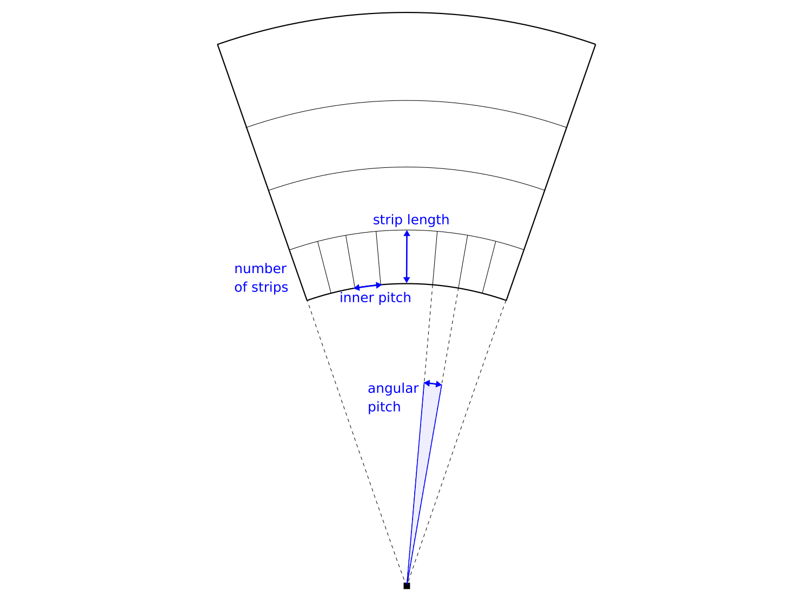
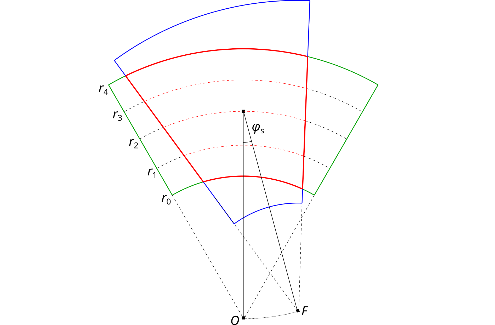

Allpix Squared implements different sensor geometries such as rectangular, Cartesian pixel grids, hexagon patterns, or radial
strip-like channels. This section details the different geometries and their respective coordinate system. Geometries are
selected via the parameter `geometry` in the detector model file.

## Rectangular Pixels on a Cartesian Grid

This geometry is the default assumed for any detector without the `geometry` keyword. The individual channels are rectangular
pixels, the `pixel_size` parameter denotes the pitch in Cartesian `x` and `y` direction.

This geometry can be selected using `geometry = pixel`

## Hexagonal Pixels

Hexagonal pixel grids in Allpix Squared use an axial coordinate system to describe the relative positions and indices of
hexagons on the grid, following largely the definitions provided in \[[@hexagons]\]. Similar to the Cartesian coordinate
system used for regular pixel layouts, the origin is the lower-left corner of the sensor, with the hexagon indices $`(0,0)`$.
Owing to the orientation of the grid axes, negative can occur in the top-left region of the sensor.

Two orientations of hexagons are supported, subsequently referred to as *pointy* with sides parallel to the $`y`$ axis of the
Cartesian coordinate system and corners at the top and bottom, and *flat* with sides parallel to the Cartesian $`x`$ axis and
corners to the left and right. The pitches $`p_x`$ and $`p_y`$ of the hexagon align with the axial coordinate system and are
rotated differently with respect to the Cartesian system between the two variants. The orientation of the pitches as well as
the resulting corner positions in Cartesian coordinates are shown in the figure below:

\
*Definition of the pitches $`p_x`$ and $`p_y`$, and corner positions for the pointy (left) and flat (right) hexagon
orientation in Cartesian coordinates. The pitches align with the axes of the axial coordinate system of the hexagonal grid.*

The additional parameters for the **hexagonal** model are as follows:

- `pixel_type`:
   The shape/orientation of the hexagonal pixels within the grid, either `hexagon_pointy` or `hexagon_flat`.

The number of pixels in a hexagonal grid are counted along the Cartesian axes, taking the offset pixels into account.
For example, an 8-by-4 grid comprises 32 pixels both for *pointy* and *flat* hexagon orientation, but results in different
overall grid dimensions as demonstrated below:

\
*Grid layouts for pointy (left) and flat (right) hexagons with a size of 8-by-4 pixels.*

This geometry can be selected using `geometry = hexagon`

## Radial Strips

Radial strip detectors feature a trapezoidal shape with curved edges and radial geometry – the strips on such a sensor are arranged in a fan-like geometry, pointing to a common focal point. Shape, size and segmentation of a radial strip detector are defined using four parameters, each passed as an array with the number of elements equal to the number of strip rows:
- `number_of_strips`
- `angular_pitch`
- `inner_pitch`
- `strip_length`

Additionally, model parameters have to be set to `type = monolithic` and `geometry = radial_strip`. Due to the complexity of the geometry, this detector model currently doesn't allow the creation of passive support structures.

For radial strip detectors, the coordinate origin is placed in the centre of concentric arcs, which form the strip row edges, to enable easier transformation to polar coordinates utilized by the detector model's member functions.

The optional parameter `stereo_angle` can be used to shift the strip focal point around the center of the sensor to create an asymmetrical sensor. By default, the stereo angle is disabled.

An examples of radial strip detector model implementation can be seen in `models/atlas_itk_r0` and further in the `examples/atlas_itk_petal` example.

[@hexagons]: https://www.redblobgames.com/grids/hexagons/
